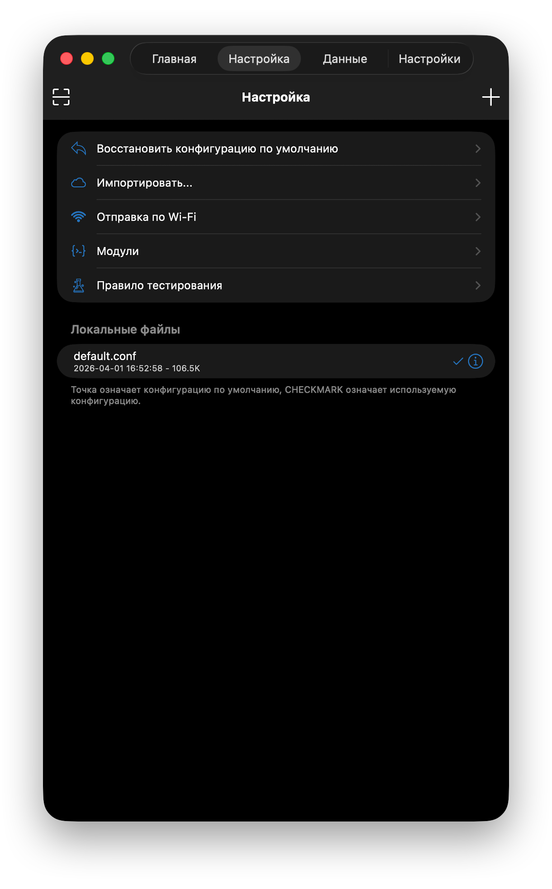
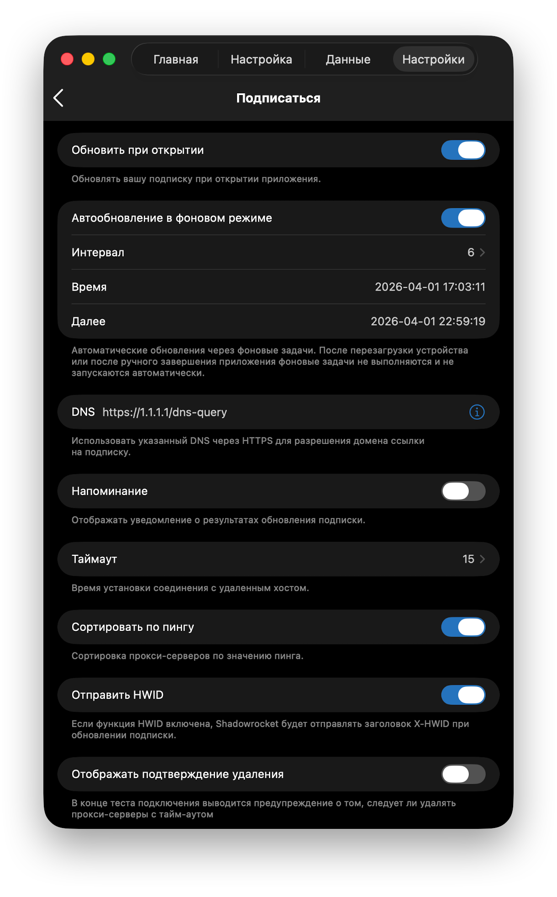
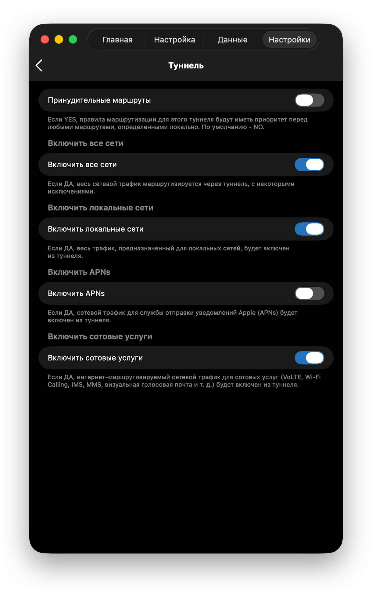
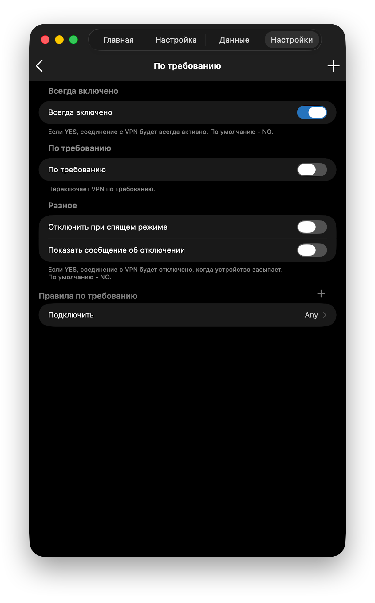
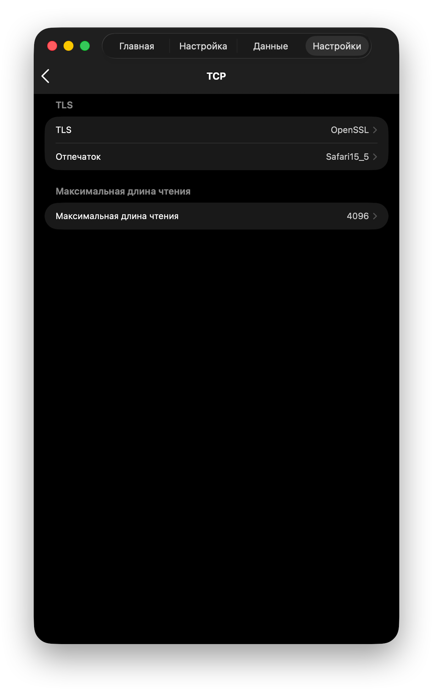
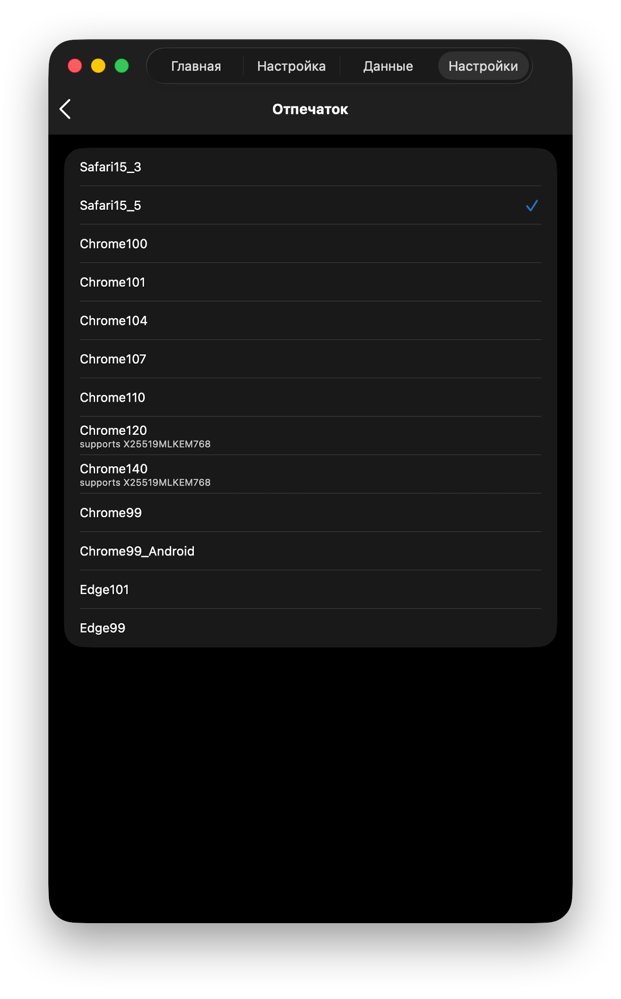
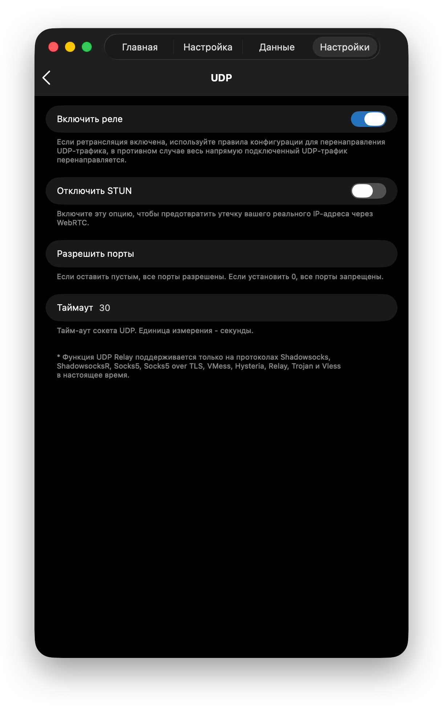

# shadowrocket-vpn

VPN-менеджер для Shadowrocket (iOS/macOS). Объединяет несколько VPN-подписок в одну, автоматически выбирает лучший сервер по пингу, пускает заблокированные сервисы через Cloudflare WARP.

Работает из РФ. Telegram, Instagram, ChatGPT, Gemini — всё через WARP с чистым IP.

## Установка

```bash
git clone https://github.com/your-username/shadowrocket-vpn.git
cd shadowrocket-vpn
./install.sh
```

Скрипт:
1. Установит зависимости (wgcf, wrangler)
2. Авторизует в Cloudflare (бесплатно)
3. Спросит твои VPN-подписки
4. Задеплоит воркер и выдаст ссылки

## Использование

```bash
./vpn
```

```
  1 добавить подписку      5 деплой
  2 удалить подписку       6 тест пинга
  3 добавить пинг-таргет   7 добавить WARP-домен
  4 удалить пинг-таргет    8 удалить WARP-домен
  0 выход
```

## Настройка Shadowrocket (пошагово)

После установки у тебя будет 3 ссылки. Добавляй их в Shadowrocket **именно в таком порядке**:

### Шаг 1. Добавить конфигурацию (ПЕРВЫМ)

1. Открой Shadowrocket
2. Перейди во вкладку **Настройка** (внизу)
3. Нажми **+** (плюс вверху справа)
4. Вставь ссылку на конфиг: `https://sub-merger.XXXX.workers.dev/conf`
5. Нажми **Скачать**
6. Нажми на скачанный конфиг чтобы **активировать** (появится галочка)

### Шаг 2. Добавить подписку (ВТОРЫМ)

1. Перейди на вкладку **Главная**
2. Нажми **+** (плюс вверху справа)
3. Выбери **Subscribe**
4. В поле URL вставь: `https://sub-merger.XXXX.workers.dev/sub`
5. Нажми **Сохранить**

> Важно: конфиг добавляется ПЕРВЫМ, подписка ВТОРОЙ. Тогда WARP-сервер будет ниже твоих основных серверов.

<details>
<summary>Скриншот: вкладка Настройка</summary>


</details>

### Шаг 3. Базы данных GeoLite2

1. **Настройки** → пролистай до **GeoLite2 Database**
2. В поле **Country URL** вставь:
   ```
   https://cdn.jsdelivr.net/gh/Loyalsoldier/geoip@release/GeoLite2-Country.mmdb
   ```
3. Нажми **Обновить**
4. В поле **ASN URL** вставь:
   ```
   https://cdn.jsdelivr.net/gh/Loyalsoldier/geoip@release/GeoLite2-ASN.mmdb
   ```
5. Нажми **Обновить**
6. Включи **Автообновление в фоновом режиме**

### Шаг 4. Метод тестирования

1. **Настройки** → **Метод тестирования**
2. Переключи на **CONNECT**
3. Это тестирует реальное подключение через прокси, а не просто пинг

<details>
<summary>Скриншот: настройки подписки</summary>


</details>

### Шаг 5. Настройки туннеля

1. **Настройки** → **Туннель**
2. **Включить все сети** → включить
3. **Включить локальные сети** → выключить
4. **Включить APNs** → выключить
5. **Включить сотовые услуги** → выключить

<details>
<summary>Скриншот: туннель</summary>


</details>

### Шаг 6. Настройки подписки

1. **Настройки** → **Подписаться**
2. **Обновить при открытии** → включить
3. **Автообновление в фоновом режиме** → включить
4. **Сортировать по пингу** → включить (ВАЖНО — это сортирует все серверы)
5. **Отправить HWID** → выключить (не отправлять ID устройства провайдерам)

### Шаг 7. Разрешения

1. **Настройки** → **Разрешения**
2. **Буфер обмена** → выключить (чтобы не мешал после настройки)

<details>
<summary>Скриншот: По требованию</summary>


</details>

### Шаг 8. TCP

1. **Настройки** → **TCP**
2. **Отпечаток** → выбери **Chrome140** (самый свежий, обходит DPI)

<details>
<summary>Скриншоты: TCP и отпечаток TLS</summary>



</details>

### Шаг 9. UDP

1. **Настройки** → **UDP**
2. **Включить реле** → включить (голос/видео в Telegram через прокси)
3. **Отключить STUN** → включить (защита от утечки IP через WebRTC)

### Шаг 10. По требованию

1. **Настройки** → **По требованию**
2. **Всегда включено** → включить (VPN не отваливается)
3. **Показать сообщение об отключении** → включить

<details>
<summary>Скриншот: UDP</summary>


</details>

## Как работает

```
РФ-сайты (yandex, vk, ...)      → DIRECT  (напрямую)
Telegram, Instagram, Gemini, GPT → WARP    (прокси → Cloudflare WARP)
YouTube, GitHub, Discord, ...    → PROXY   (лучший сервер по пингу)
Реклама                          → REJECT  (блокируется)
Всё остальное                    → PROXY
```

### WARP

Некоторые сервисы блокируют VPN-серверы по IP (Gemini, ChatGPT) или сильно тормозят (Telegram, Instagram в РФ). WARP решает это:

```
Телефон → VPN-прокси → Cloudflare WARP → Интернет
```

Cloudflare WARP даёт чистый IP из US/EU. WARP-ключи обновляются автоматически при каждом деплое.

### Пинг-тест

Эндпоинт `/ping` проверяет доступность ВСЕХ твоих важных сервисов. Если **хоть один** недоступен — сервер помечается как плохой. Shadowrocket автоматически переключится на рабочий.

## Файлы

| Файл | Что делает |
|------|-----------|
| `vpn` | Главный скрипт (меню) |
| `vpn-config.json` | Твой конфиг (подписки, пинги, WARP-домены) |
| `vpn-generate.py` | Генератор worker.js + shadowrocket.conf |
| `install.sh` | Установка |
| `vpn-config.example.json` | Шаблон конфига |
| `wrangler.toml` | Конфиг Cloudflare Worker |

## Зависимости

- macOS / Linux
- python3
- [wgcf](https://github.com/ViRb3/wgcf) — генерация WARP-ключей
- [wrangler](https://developers.cloudflare.com/workers/wrangler/) — деплой на Cloudflare
- Бесплатный Cloudflare-аккаунт
